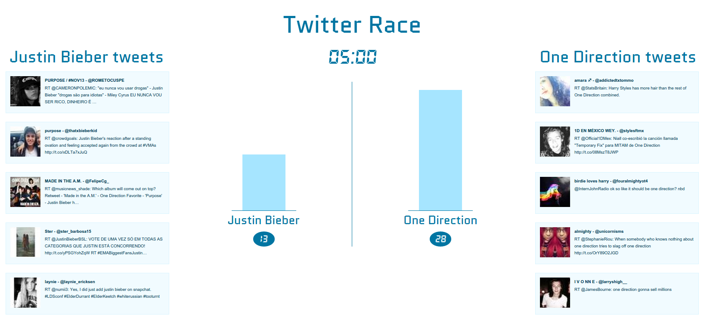

# TO BE UPDATED

# Twitter Race

<i>24 hours Hackathon - started September 8, 2015</i>

http://twitter-race.herokuapp.com/



## Description
You are discussing popularity of something with friends? You are willing to bet them a beer? Use <a href="{{page.website}}" target="_blanck">Twitter-Race</a> to determine the winner. The app allows you two enter two search words. Then it starts counting all the tweets that appear on Twitter with those words for 15 seconds and shows the score. You can see the tweets coming in and the counter in real time. Additionally you can view results of races other people have done recently.

## Inspiration
In my web development course we did a little exercise that showed us how to use the <a href="https://dev.twitter.com/streaming/overview" target="_blanck">Twitter API</a> that provides tweets as a live stream. I found it a pretty cool gimmick and wanted to build Twitter Race from that point on. My chance came when a 24-hour Hackathon was announced on the course where we could build  whatever fun app we wanted to build.

## Methods and Algorithms
### Scaling the bar chart
The live tweet count is shown in a bar chart. Since the final count can be something between 2 or 200 tweets I had to find a solution for setting the height of the bars. I wanted the user to see a clear growth of the bars in the beginning. So if there are less than 30 tweets I scale the bar linearly with the counter. After that point I need the bar height to stop growing while still keeping the correct relative height between the left and the right bar. This is done by the following code. After the treshold of 30 tweets the higher bar is fixed to height 300. The height of the lower bar is scaled accordingly. The heights are then applied via two-way data-binding and inline CSS.
```javascript
this.calcBarHeight = function(){
  this.bar = {left: this.counter1*10, right: this.counter2*10};
  if(this.counter1 > 30 || this.counter2 > 30){
    if(this.counter1 > this.counter2){
      this.bar = {
        left: 300,
        right: 300 * this.counter2 / this.counter1
      };
    } else {
      this.bar = {
        left: 300 * this.counter1 / this.counter2,
        right: 300
      };
    }
  }
};
```

### SetTimeout/ SetInterval and Angular
Using the JavaScript `setTimeout` or `setInterval` function in an Angular app needs a bit of extra care. If those function change for example my countdown variable every second out of the box Angular would not know about it and the two-way data-binding to the view would not work. To tell Angular to check the variables I used the `$apply()` function. Unfortunatly when using Controller-As syntax there is no other way to do that than to inject `$scope`. This is a bit ugly. I wonder whether there will be a better solution for this in later versions of Angular.

```javascript
self.countdown = 15;
intervalId = $window.setInterval(function() {
  self.countdown--;
  $scope.$apply();
}, 1000);
```

## Front-end
### JavaScript code
The front-end is build with <a href="https://angularjs.org/" target="_blanck">AngularJS</a>. The real-time connection to the back-end is established via <a href="http://socket.io/" target="_blanck">socket.io</a> which uses the WebSockets protocol. The socket.io functionality is wrapped in a nice Angular factory as explained in this <a href="http://www.html5rocks.com/en/tutorials/frameworks/angular-websockets/" target="_blanck">blog post</a>.

### Markup
To keep the markup DRY despite the repeating pattern in the left and right half of the screen custom directives are used. For example we can define the html template for one of the tweets in a separate file and then add this directive.
```javascript
angular.module('twitterRace')
.directive("tweet", tweetDirective);

function tweetDirective(){
  var directive = {};
  directive.restrict = "E";
  directive.replace = true;
  directive.templateUrl = "./js/templates/_tweet.html";
  directive.scope = { tweetData: "=" };
  return directive;
}
```

So the markup for one of the tweet streams on `index.html` reduces to the following by using the newly defined `tweet` tag.
```html
<ul class="medium-3 medium-pull-6 small-6 column no-bullet">
  <h2 class="title">{{main.searchTerms.search1}} tweets</h2>
  <li ng-repeat="tweetData in main.tweets1">
    <tweet tweet-data="tweetData"></tweet>
  </li>
</ul>
```

### Styling
The styling is done with the SASS version of <a href="http://foundation.zurb.com/" target="_blanck">ZURB Foundation</a>. The app strongly relies on Foundations grid system for being responsive. Especially using `push` and `pull` for changing the order of column depending on screen size came in handy. That way the tweet streams can be shown to the left and the right of the bar chart on big stream but below the chart on small screens.

```html
<div class="row" ng-if="main.status >= 0">
  <div class="medium-6 medium-push-3 small-12 column text-center main-box">
    <!-- markup for bar charts in the middle-->
  </div>

  <ul class="medium-3 medium-pull-6 small-6 column no-bullet">
    <!-- markup for tweets to left -->
  </ul>

  <ul class="medium-3 small-6 column no-bullet">
    <!-- markup for tweets to left -->
  </ul>
</div>
```

## Back-end
### Framework
The back-end is a simple NodeJS application with <a href="http://expressjs.com/" target="_blanck">Express</a> as framework with is very light-weight. In fact, it is so light, it cannot even render an HTML page on its own. To make Express serve a file labelled `.html` I had to require the whole `ejs` package which then exposes a function that can be used to set up the view engine for simple html files.
```javascript
app.engine('html', require('ejs').renderFile);
```
To access the Twitter Stream API the npm package `Twit` is used. It allows you to initialize a new object with all you API keys, tokens and secrets and is then ready to use (here called `twitter`). If the search terms emitted by the front-end are recived two streams are set up, one for each search term. Incoming tweets are then emitted to front-end with the respective event name (`tweet1` or `tweet2`).

```javascript
socket.once("search", function(searchTerms){
  if(!currentSearch && searchTerms){
    currentSearch = searchTerms;
    stream1 = twitter.stream('statuses/filter', {track: searchTerms.search1});
    stream2 = twitter.stream('statuses/filter', {track: searchTerms.search2});
    stream1.on('tweet', function(tweet) {
      socket.emit('tweet1', formatTweetData(tweet));
    });
    stream2.on('tweet', function(tweet) {
      socket.emit('tweet2', formatTweetData(tweet));
    });
  }
});
```

### Database
<a href="https://www.firebase.com/" target="_blanck">Firebase</a> is used to store the past race results. This is done very conveniently using <a href="https://www.firebase.com/docs/web/libraries/angular/" target="_blanck">Angular Fire</a>. Similar to "ngResource" it comes with "all/query", "add", "save" functionality. But on top it allows for 3-way data-binding for arrays and objects.